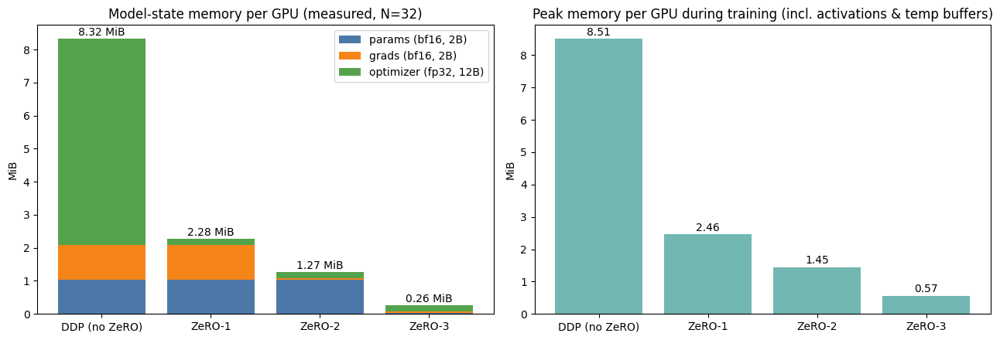
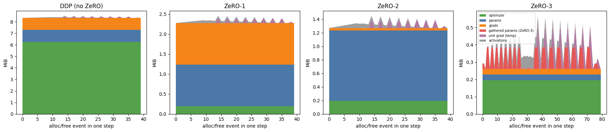
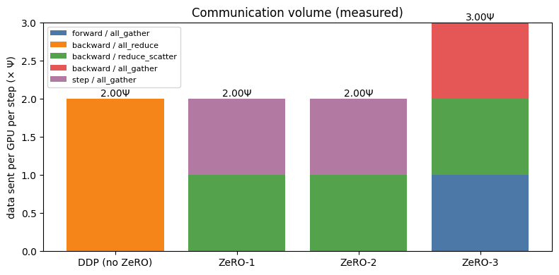
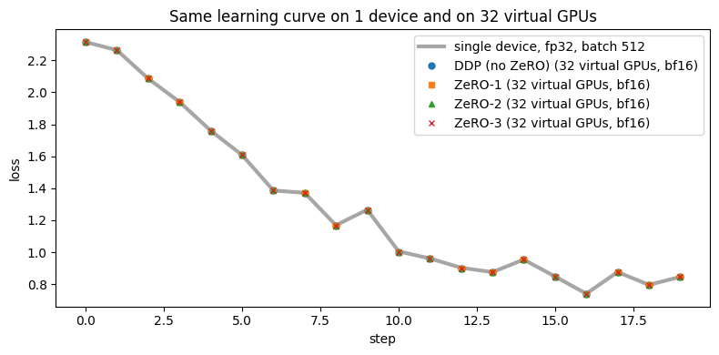
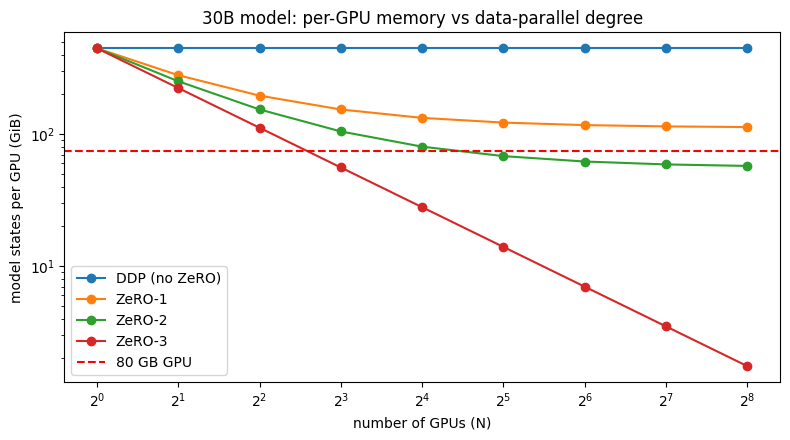

# ZeRO Stages on 32 Virtual GPUs

**ERA V5 -- Session 12 assignment (session of 12 Sep 2026)**

Build 32 virtual GPUs, run a demo model on them, simulate **ZeRO-1 / ZeRO-2 / ZeRO-3**, show how memory and computation change, and verify the results against the ZeRO paper.

Everything runs on **CPU in plain PyTorch** -- no real GPUs, no DeepSpeed, no NCCL. The notebook takes about a minute end to end, on a laptop or in Colab.

---

## Contents

| File | What it is |
|---|---|
| [`zero_stages_32_virtual_gpus.ipynb`](zero_stages_32_virtual_gpus.ipynb) | Main notebook: theory, the four training runs, plots, verification, pros and cons. Committed **with outputs** so it can be read without running |
| [`zero_sim.py`](zero_sim.py) | The simulator: `VirtualGPU`, `VirtualCluster` (collectives + cost model), `ZeroTrainer` (stages 0-3), and the paper's memory/communication formulas |
| `images/` | Plots exported from the notebook |
| `requirements.txt` | torch, pandas, matplotlib, jinja2 |

### How to run

```bash
git clone <this repo>
cd S12
pip install -r requirements.txt
jupyter lab zero_stages_32_virtual_gpus.ipynb   # then Run All
```

In Colab, upload the notebook and run all cells -- the first code cell writes `zero_sim.py` itself, so the notebook is self-contained.

### Assignment checklist

| Asked for | Where |
|---|---|
| 32 virtual GPUs, runnable on a laptop or Colab | `VirtualCluster(32, gpus_per_node=8)`, notebook sect 3 |
| A demo model running on them | residual MLP, 545,546 params, 10 units, notebook sect 4-5 |
| Simulate ZeRO-1/2/3 and show memory + computation changes | notebook sect 5.1-5.3: measured memory, per-step memory timeline, communication volume |
| Make sure it matches what ZeRO does | notebook sect 6: bit-identical weights, formulas, paper Table 1, the lecture's 30B numbers, an OOM demo, communication time |
| Explain the stages and their pros and cons | notebook sect 1 and sect 7, summarised below |

---

## Background: why ZeRO exists

With mixed-precision Adam, each parameter costs **16 bytes**:

| Item | dtype | bytes |
|---|---|---|
| working weights | bf16 | 2 |
| gradients | bf16 | 2 |
| master weights | fp32 | 4 |
| Adam momentum `m` | fp32 | 4 |
| Adam variance `v` | fp32 | 4 |
| **total** | | **16** (the paper's optimizer part is *K = 12*) |

A 30B model therefore needs **447 GiB** of model states -- more than five 80 GB cards -- before a single activation is stored. Plain data parallelism doesn't help: every GPU keeps an identical copy of all 16 bytes, so 8 GPUs hold 8 copies of the same 447 GiB.

ZeRO removes that redundancy in stages. The enabling fact is that **all-reduce = reduce-scatter + all-gather**, so sharding costs no extra bytes until stage 3:

| Stage | Sharded across N GPUs | Memory / GPU | Comm / step |
|---|---|---|---|
| 0 -- data parallel | nothing | 16Ψ | 2Ψ |
| 1 -- P<sub>os</sub> | optimizer states (12 B) | 4Ψ + 12Ψ/N | 2Ψ |
| 2 -- P<sub>os+g</sub> | + gradients (2 B) | 2Ψ + 14Ψ/N | 2Ψ |
| 3 -- P<sub>os+g+p</sub> | + weights (2 B) | 16Ψ/N | **3Ψ** |

---

## How the simulation works

**Virtual GPU.** `VirtualGPU` is a named store of real tensors. Every `alloc` / `free` updates a byte counter per category (params, grads, optimizer, activations, temporary buffers) and tracks the peak. Memory is therefore **measured** from the tensors a GPU actually holds, never assumed from a formula. Giving a GPU a `capacity_bytes` turns it into a card that can raise `OutOfMemory`.

**Cluster.** `VirtualCluster(32, gpus_per_node=8)` = 4 nodes x 8 GPUs. It provides `all_reduce`, `reduce_scatter` and `all_gather` with NCCL semantics, and logs ring-algorithm cost for every call: each rank sends 2(N-1)/N*M for an all-reduce and (N-1)/N*M for each of the other two. Estimated time uses the slowest link in the ring -- NVLink at 450 GB/s inside a node, InfiniBand at 50 GB/s across nodes.

**Model and data.** A residual MLP (`in_proj -> 8 x 256x256 blocks -> head`, 545,546 params) split into 10 **units**; ZeRO-3 gathers and frees one unit at a time, the way FSDP does. Each parameter tensor is flattened and padded to a multiple of 32 so it shards evenly. Each GPU gets its own micro-batch of 16 (global batch 512); labels come from a fixed random teacher network, so the loss actually goes down.

**One step, per stage** (`ZeroTrainer.step()`):

| | forward | backward | optimizer step |
|---|---|---|---|
| **DP** | local full params | all-reduce each unit's grads as they become ready | full Adam on every GPU |
| **ZeRO-1** | local full params | keep full local grads, reduce-scatter after backward | Adam on my 1/32 slice, then all-gather params |
| **ZeRO-2** | local full params | reduce-scatter each unit during backward, keep only my grad shard | Adam on my slice, then all-gather params |
| **ZeRO-3** | all-gather unit -> compute -> free | all-gather again -> compute -> reduce-scatter grads -> free | Adam on my slice; nothing to gather, I only own my shard |

---

## Results (N = 32)



| Stage | Model states / GPU (measured) | Paper formula | Peak incl. activations | Comm / step |
|---|---|---|---|---|
| DP (no ZeRO) | 8.32 MiB | 16Ψ | 8.51 MiB | 2.00Ψ |
| ZeRO-1 | 2.28 MiB | 4Ψ + 12Ψ/N | 2.46 MiB | 2.00Ψ |
| ZeRO-2 | 1.27 MiB | 2Ψ + 14Ψ/N | 1.45 MiB | 2.00Ψ |
| ZeRO-3 | 0.26 MiB | 16Ψ/N | 0.57 MiB | **3.00Ψ** |

Memory within a single step, GPU 0. DP and ZeRO-1 are flat and high; ZeRO-2 sits lower with small bumps where one unit's full gradient briefly exists; ZeRO-3 has the lowest baseline and pays for it in gather spikes:



Communication is where ZeRO-3 loses. Stages 1 and 2 swap one all-reduce for a reduce-scatter plus an all-gather, so the bytes don't change; stage 3 has to gather the weights twice per step:



## Verification -- does this match what ZeRO really does?

1. **The maths is unchanged.** All four runs end with **bit-identical fp32 master weights** and identical losses, and they track a single-device fp32 run (max loss difference ~ 0.002). Adam is element-wise, so updating 32 shards is exactly updating the whole tensor.

   

2. **Memory matches the formulas exactly** (measured bytes == `zero_model_state_bytes`).
3. **Communication matches the paper:** measured 2.00Ψ / 2.00Ψ / 2.00Ψ / 3.00Ψ per GPU per step.
4. **ZeRO paper Table 1 is reproduced entry for entry** (7.5B model, N = 1 ... 1024: 120 GB -> 30.1 / 15.1 / 0.12 GB).
5. **The lecture's 30B example** comes out as 447 -> 153.7 -> 104.8 -> 55.9 GiB on 8 GPUs (lecture: 447 / 153 / 104 / 55).
6. **OOM demo:** with a 2 MiB budget per virtual GPU, DP and ZeRO-1 raise `OutOfMemory` while ZeRO-2 and ZeRO-3 train.



ZeRO-1 and ZeRO-2 flatten out at 4Ψ and 2Ψ, because their unsharded part never shrinks. **Only ZeRO-3 keeps scaling as 1/N**, which is what makes a model larger than one GPU trainable at all. On 32 x 80 GB, the largest model states that fit are roughly 5B (DP), 18B (ZeRO-1), 33B (ZeRO-2) and 160B (ZeRO-3).

### Communication is the real cost
For a 30B model (Ψ = 60 GB of bf16 payload), with the lecture's link speeds:

| Stage | Volume | 1 node (NVLink) | Multi-node (InfiniBand) | Idle share of a 7.1 s step |
|---|---|---|---|---|
| DP / ZeRO-1 / ZeRO-2 | 2Ψ = 120 GB | 0.27 s | 2.4 s | ~34% |
| ZeRO-3 | 3Ψ = 180 GB | 0.40 s | 3.6 s | ~51% |

That 34% is the lecture's point about paying $10,000 for compute and getting $3,400 of idle GPUs. It's also why multi-node ZeRO-3 needs prefetching, bucket tuning and overlap -- or a hybrid layout (shard inside a node, replicate across nodes).

## Pros and cons

| | Pros | Cons | Use when |
|---|---|---|---|
| **DP (stage 0)** | Simplest, fastest; one all-reduce per bucket, overlapped with backward | 16Ψ per GPU; more GPUs never reduce per-GPU memory (~5B ceiling on 80 GB) | Model + optimizer fit comfortably on one GPU |
| **ZeRO-1** | Removes 12 of 16 bytes at **no extra communication**; trivial to switch on | Params and grads still replicated -> 4Ψ floor; needs an all-gather after the step | Model fits but Adam states don't. Usually the first thing to enable |
| **ZeRO-2** | Also shards grads, still 2Ψ; no full gradient buffer; 2Ψ floor | Bucket size and reduce-scatter scheduling to tune; weights still replicated | **Default for most mid-size runs** -- near-DP speed, much less memory |
| **ZeRO-3** | Everything scales as 1/N; trains models bigger than a single GPU | **1.5x communication**, many small all-gathers, gather spikes, most tuning, very sensitive to inter-node links | The weights themselves don't fit. Best with a fast interconnect, or kept within a node |

**Rule of thumb:** pick the lowest stage that fits, then ask whether the run is compute-bound or communication-bound. ZeRO covers model states only -- activation memory still needs checkpointing, a single layer too large for one GPU still needs tensor parallelism, and offload (ZeRO-Offload / Infinity) plus FP8 are the next levers.

## Reference
Rajbhandari, Rasley, Ruwase, He. *ZeRO: Memory Optimizations Toward Training Trillion Parameter Models*, SC 2020 -- [arXiv:1910.02054](https://arxiv.org/abs/1910.02054).
