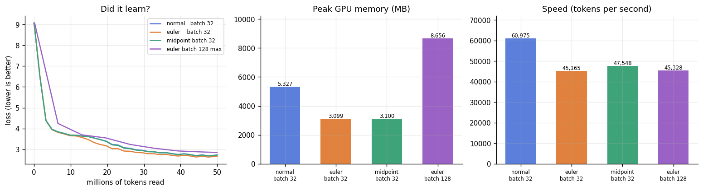
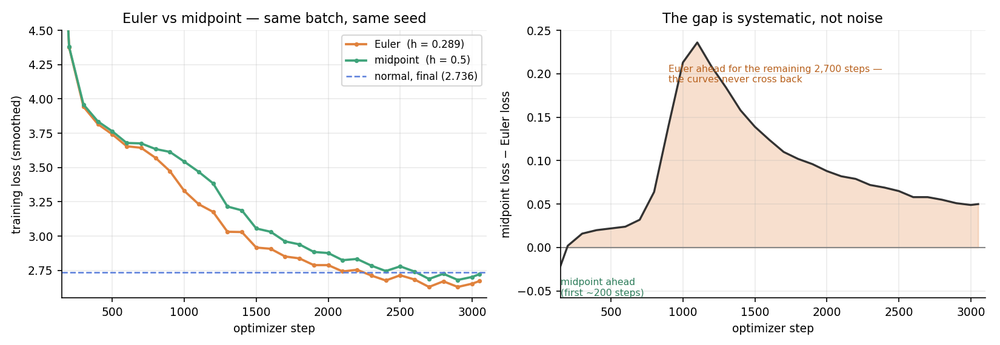

# Reversible Training

**ERA V5 — Session 13** (19 Sep 2026, *Distributed Training, Part 2*)

Everything is in one file: **[`reversible_training.ipynb`](reversible_training.ipynb)**.
Upload it to Google Colab, set **Runtime → Change runtime type → T4 GPU**, and Run All.

---

## The assignment

> Train 50 million tokens. Fix the biggest batch size you can run **without** reversibility.
> Then train again **with** reversibility — test both variants and report which works better for you.
> Then push the batch size to its maximum.
> In the report: the final loss for all runs, the speed in tokens per second, the memory peak, and other findings.

---

## The problem, in plain words

When a model learns it makes two passes over your text.

* **Forward pass** — text goes in at layer 1, comes out at layer 12, the model makes a guess.
* **Backward pass** — the model works out how wrong it was and nudges every layer.

The catch: the backward pass at layer 7 needs to know **what layer 7 saw** during the forward pass.
So normally the model *writes down* what every layer saw and keeps those notes in GPU memory.
Those notes are called **activations**.

12 layers → 12 sets of notes. 100 layers → 100 sets. Longer text → each set is bigger.
**This is what makes you run out of GPU memory.**

## What reversible means

Climbing stairs in the dark, you drop a breadcrumb on every step so you can find your way back —
100 steps, 100 breadcrumbs.

**Reversible** means building the staircase so that from where you are standing you can *work out*
the step below you. No breadcrumbs at all. Only your current position.

For a model: throw away every activation on the way up, then **recalculate** each layer's input from
the layer above it on the way down. We trade **memory** for **arithmetic**.

## Why a normal layer can't do it

| Symbol | Meaning |
|---|---|
| `x` | the **hidden state** — a grid of numbers carrying what the model currently thinks, one row per word |
| `x_old` / `x_new` | the hidden state going **into** / coming **out of** a layer |
| `F` | **the layer itself** — give it a hidden state, it hands back a *change* of the same shape |
| `h` | the **step size** — just a number you pick, like `0.5` |

A normal layer is `x_new = x_old + F(x_old)`. Reversing it means `x_old = x_new − F(x_old)` —
and to get `x_old` you need `F(x_old)`, which needs `x_old`. **A circle. Dead end.**

## The two fixes

Both carry **two grids instead of one**. That second grid is what breaks the circle.

### Version 1 — Euler

Carry a **position** `x` and a **speed** `v` (a second grid, starts at all zeros).

```
FORWARD                            BACKWARD
  v_new = v_old + h * F(x_old)       x_old = x_new - h * v_new
  x_new = x_old + h * v_new          v_old = v_new - h * F(x_old)
```

The first backward line uses only `x_new` and `v_new` — both already in hand. **No circle.**
Once it gives you `x_old`, you can safely compute `F(x_old)` for the second line.

### Version 2 — Midpoint

Carry the **current** position and the **previous** one. This is the lecture's formula.

```
FORWARD                            BACKWARD
  x_new = x_two_ago + 2h*F(x_now)    x_two_ago = x_new - 2h*F(x_now)
```

Same escape: `F` is fed `x_now`, which we already hold.

### How they differ

Guessing where a car will be one second from now:

* **Euler** uses the speed **at the start**. If the car is speeding up, the guess is too low — a
  small error, on every single layer.
* **Midpoint** takes a double-length step but uses the speed **from the middle**. Too low in the
  first half cancels too high in the second half.

Midpoint is more accurate per layer. It also has a second advantage: run its formula backwards and
it is *the same formula* — it is **symmetric** — so errors don't pile up in one direction going down
the stack. That is why the lecture says midpoint wins.

Neither is free: **Euler's** speed grid keeps accumulating, so the hidden state can grow bigger than
intended (we pick a smaller `h` to hold it back). **Midpoint's** even-numbered and odd-numbered
layers form two chains that only meet through `F`, and they can slowly drift apart.

## The price

| | |
|---|---|
| **Speed** | Every layer runs one extra time going down → roughly **30–40 % slower** |
| **No dropout** | The backward pass *recalculates* `F`. Anything random gives a different answer the second time, and the gradients are **silently wrong** — no error, just a worse model |
| **No weight decay** | Switched off in the normal run too, so the comparison is fair |

---

## What the notebook does

| Part | What happens |
|---|---|
| 1–4 | The explanation above, plus the layer, the three stacking rules, and the memory trick |
| **5–6** | **Three proofs** — that the stack really inverts, that the memory-free gradients match PyTorch's own, and that memory stops growing with depth |
| 7 | Downloads Indic text (AI4Bharat Sangraha: Hindi, Telugu, Tamil, Marathi, Bengali, English) and trains an 8192-piece byte-level tokenizer |
| 8 | The training loop |
| 9 | The four runs |
| 10–11 | The results table, the plots, and what to write in the report |

**Fixed settings**, so your numbers are comparable with anyone else's rather than depending on which GPU Colab handed you:

| | |
|---|---|
| Model | 12 layers, width 384 — **~19.9M parameters** |
| Runs 1–3 | **batch 32** (~3,000 optimizer steps over 50M tokens) |
| Run 4 | **batch 128**, falling back to 64 then 32 if the GPU runs out |

⚠️ Expect run 4's loss to be slightly *worse* than run 3's. At batch 128 the same 50M tokens buy only ~760 steps instead of ~3,000. That is the finding, not a bug.

Part 6 is the part worth your time. It checks the hand-written backward pass against PyTorch's
answer, weight by weight, in 64-bit — so you can state that the gradients are exact rather than
hoping they are.

**Roughly how long:** ~10 min to download and tokenise, then 45–70 min for all four runs on a T4
(~20 min on an A100). Set `TOKENS = 5_000_000` in Part 7 for a quick trial first.

The whole thing is **~500 lines of code across 12 cells**, with 13 markdown cells explaining them.

---

## Results

Run on a **Tesla T4** (Colab), ~20M parameter model, 50M tokens of Indic text per run.
**68 minutes and $0.40 in total.**

| run | batch | steps | train loss | val loss | ppl | tokens/s | peak MB | min | US$ |
|---|---:|---:|---:|---:|---:|---:|---:|---:|---:|
| 1 — normal | 32 | 3,051 | 2.736 | 2.664 | 14.4 | 60,975 | 5,327 | 13.7 | 0.08 |
| 2 — **Euler** | 32 | 3,051 | 2.673 | **2.610** | **13.6** | 45,165 | **3,099** | 18.4 | 0.11 |
| 3 — midpoint | 32 | 3,051 | 2.723 | 2.656 | 14.2 | 47,548 | 3,100 | 17.5 | 0.10 |
| 4 — Euler, pushed | 128 | 762 | 2.851 | 2.803 | 16.5 | 45,328 | 8,656 | 18.4 | 0.11 |



*Left — all four losses fall from 9.1 (random guessing on an 8192-token vocabulary is `ln 8192 =
9.01`) to under 3. The purple batch-128 run sits visibly above the rest from ~5M tokens on. The three
batch-32 curves are almost on top of each other at this scale — which is why the next figure exists.
Middle — peak memory: the two reversible bars are a little over half the normal bar at the same
batch. Right — throughput: the price, about a quarter.*



*The same two reversible runs, zoomed. Left — midpoint (green) leads for ~200 steps, then Euler
(orange) takes over and stays ahead. Both finish below the normal model's final training loss
(dashed). Right — the gap between them, step by step: it crosses zero once, near step 250, and never
returns. It peaks at 0.24 around step 1,100 and then narrows to 0.05, which is the signature of Euler
converging faster rather than reaching a better place.*

### The three headline numbers, at the same batch size

| | normal | Euler | change |
|---|---:|---:|---|
| peak memory | 5,327 MB | 3,099 MB | **−41.8 %** |
| throughput | 60,975 tok/s | 45,165 tok/s | **−25.9 %** |
| validation loss | 2.664 | 2.610 | **−0.054** |

### Memory does stop growing with depth

Proof 3, measured on the GPU — the same model built at four depths:

| layers | normal | Euler | midpoint |
|---:|---:|---:|---:|
| 4 | 158 MB | 57 MB | 53 MB |
| 8 | 258 MB | 53 MB | 49 MB |
| 16 | 503 MB | 63 MB | 63 MB |
| 32 | 992 MB | 89 MB | 85 MB |
| **growth 4→32** | **6.28×** | **1.55×** | **1.59×** |

Eight times the depth costs the normal model 6.3× the memory and the reversible models 1.6×. At 32
layers reversibility is using **11× less**. The reversible columns are not perfectly flat because
the measurement also includes gradient buffers for the weights, which genuinely scale with depth and
were never activations.

---

## Findings

### 1. Euler won, and the curves prove it better than a second seed would

Final validation loss **2.610 vs 2.656** — Euler ahead by **0.046**. On its own that is a number you
would want to re-run with another seed. The trajectories make that unnecessary:

| step | Euler | midpoint | gap |
|---:|---:|---:|---:|
| 100 | 6.508 | 6.464 | midpoint ahead |
| 300 | 3.943 | 3.959 | +0.016 |
| 1,000 | 3.330 | 3.543 | +0.213 |
| 1,500 | 2.917 | 3.056 | +0.139 |
| 2,000 | 2.789 | 2.877 | +0.088 |
| 3,051 | 2.673 | 2.723 | +0.050 |

Midpoint leads for the first ~200 steps, Euler takes over at step 300 and stays ahead for the
remaining 2,700 — the curves never cross. A noise-level difference weaves back and forth; this does
not. The gap *peaks* near step 1,000 and then narrows, so Euler is converging **faster**, not to a
better place. On a longer token budget the two might meet.

**This contradicts the lecture**, which expects midpoint to win on its better per-layer accuracy.
Two honest caveats before claiming otherwise:

* **The two runs do not use the same step size.** Midpoint runs at `h = 0.5` (so `2h = 1`, matching
  the normal model's per-layer scale); Euler runs at `h = 1/√12 = 0.289`. So this compares *Euler at
  its default* against *midpoint at its default*, not the two integrators head to head. A fair test
  would sweep `h` for both.
* **Midpoint's parasitic mode is undamped here.** Its even- and odd-numbered layers form two chains
  that meet only through `F` and can drift apart. Averaging the two streams at the output damps it;
  this notebook feeds only `x_L` to the head, as the lecture slide does.

### 2. Reversibility cost nothing in accuracy — it slightly helped

Both reversible runs matched or beat the normal model (2.610 and 2.656 vs 2.664). Euler beat it by
**0.054** — a bigger margin than it beat midpoint by.

Word this carefully. It is *not* "reversibility improves learning". The three runs are slightly
different architectures, because each uses a different step size (normal is effectively `h = 1`).
Euler's second stream is a **momentum** term on the residual path, and momentum residual networks
are independently known to train well. The defensible claim is:

> The Euler formulation trains at least as well as a standard transformer at this scale, while using
> 42 % less memory.

### 3. The slowdown beat the lecture's figure

**25.9 %** for Euler, **22.0 %** for midpoint, against the expected 30–40 %. The reason is in the
implementation: the backward pass recomputes each layer exactly **once**, not twice. Step 1 of the
backward recovers the layer's input by pure arithmetic, and the single `F` evaluation in step 2 does
double duty — it finishes the reconstruction *and* carries the gradients.

Arithmetic check: a normal step costs about `1 forward + 2 backward = 3 units`; reversible adds one
forward, so `4 units`. That predicts `1 − 3/4 = 25 %`. Measured 25.9 %.

### 4. Midpoint is faster but worse — a real trade-off

**47,548 vs 45,165 tok/s**: midpoint is 5 % quicker, because its step is one addition cheaper and its
backward does less arithmetic. It is also 0.046 worse on loss. Pick accordingly.

### 5. Pushing the batch to 128 made the model worse, exactly as expected

**2.803 vs 2.610.** The token budget is fixed at 50M, so batch 128 bought only **762** optimizer
steps where batch 32 gave **3,051** — a quarter as many. Reversibility buys you the *room* for a
bigger batch; on a fixed token budget that room does not convert into a better model.

Throughput did not improve either — **45,328 vs 45,165 tok/s**, identical. The GPU was already
saturated at batch 32, so the larger batch bought neither quality nor speed here. It would pay off
for a *longer* sequence length or a *bigger* model, which is what reversibility is actually for.

A projection from these numbers, worth stating: fitting a line through the two Euler points (3,099 MB
at batch 32, 8,656 MB at batch 128) gives **≈58 MB per sequence** reversible and a fixed overhead of
≈1.25 GB, which puts the normal model at **≈128 MB per sequence**. At batch 128 the normal model
would therefore need **≈17.2 GB** — more than a T4's 14.7 GB. **It would not fit.** Reversible does
it in 8.7 GB.

*Caveat:* batch 32 and 128 were chosen deliberately, not found by probing, so these are not measured
`B*` and `B_max`. The projection above is sound arithmetic on measured points, but it is a
projection.

### 6. The finding most write-ups will miss: reversibility is *not* exact in practice

Proof 1, in 64-bit with mixed precision off, round-trips the whole stack to within **~1e-16** — the
smallest difference a 64-bit number can express. Proof 2 shows the memory-free gradients match
PyTorch's own to **~1e-15**, over every weight tensor.

But training runs in 16-bit. The round-trip error measured at the end of each real run:

```
Euler     1.6e-02
midpoint  1.7e-02
```

**Fourteen orders of magnitude worse.** float16 carries only about three decimal digits, and the
error compounds through all 12 layers, so the reconstructed hidden states are off by roughly **1.6 %**.

And it did not matter. Euler still beat the normal model by 0.054. So the real conclusion is not
"reversibility is exact" — it is that **reversibility's gradients are badly approximate at training
precision, and training is robust to it anyway**. Quoting only Proof 1's `1e-16` would be telling
half the story.

### 7. Where the memory that was *not* saved went

Reversibility removes the per-layer activations. It does not touch the weights, the optimiser's two
running averages per weight, the token embedding, or the final `batch × 512 × 8192` grid of
predictions. The fitted fixed overhead of ≈1.25 GB and the ~58 MB per sequence that survives are
exactly this. On a model this small the logits grid alone is close to 40 % of the activation memory,
which is why the saving is ~2× rather than ~10×.

This is precisely the lecture's *"this is not one to one — some things are essentially going to be
there."*

### 8. Neither model is converged

Both losses were still falling at step 3,051. A 19.9M-parameter model wants roughly 400M tokens;
this experiment gave it 50M. That is fine for the question being asked — but it means these numbers
compare **training efficiency**, not final model quality.

---

## Choosing the batch size

Batch 32 and 128 were set deliberately, not probed. The reasoning, because it shapes the whole
result: the token budget is **fixed** at 50M, so a bigger batch buys *fewer* optimizer steps.

| batch | tokens/step | steps to finish 50M | |
|---:|---:|---:|---|
| 16 | 8,192 | 6,103 | fine, but slow per token |
| **32** | **16,384** | **3,051** | **used for runs 1–3** |
| 64 | 32,768 | 1,525 | also reasonable |
| **128** | **65,536** | **762** | **used for run 4 — borderline** |
| 256 | 131,072 | 381 | too few steps, underfit |

Below ~1,000 steps a warmup-plus-cosine schedule has no room to work. Batch 32 sits in the band that
gives roughly 3,000 steps, which also matches where the gradient-noise-scale argument puts the point
of diminishing returns for a 20M model at this loss level (~20–60k tokens per step).

The assignment asks for "the biggest batch that fits", which is a *hardware* limit and a different
number. Run 4 is the nod to that, and §5 above is what happened.

---

## Prediction vs measurement

Before running anything, the activation memory was estimated analytically. Worth recording, because
the ratio was right and the absolute numbers were not:

| per sequence, seq len 512 | predicted | measured |
|---|---:|---:|
| normal | 104.5 MB | ~128 MB |
| reversible | 52.2 MB | ~58 MB |
| **ratio** | **2.0×** | **1.72×** |

Measured values come from fitting a line through the two Euler points (3,099 MB at batch 32, 8,656 MB
at batch 128). Both estimates ran ~20% low, mostly unmodelled allocator overhead, but the prediction
that the saving would be **about 2×, not 10×** — because the logits grid is not reversible — held.

---

## Notes from actually running it

Four things cost real time. They are in here because the debugging is part of the work.

### `torch.cuda.is_bf16_supported()` lies on a T4 — a 10× slowdown

The first attempt ran at **11,783 tokens/s**, which put the four runs at roughly six hours. The
culprit was the line choosing the 16-bit type:

```python
AMP_DTYPE = torch.bfloat16 if torch.cuda.is_bf16_supported() else torch.float16   # WRONG
```

On a T4 that returns `True`. But a T4 is **Turing (compute capability 7.5)**, which has **no
bfloat16 tensor cores** — bf16 there is emulated in software. Every matmul was crawling. Turing's
*float16* tensor cores are fast (65 TFLOPS), so the fix is to key off the architecture, not the
capability flag:

```python
AMP_DTYPE = (None if DEVICE != "cuda" else
             torch.bfloat16 if torch.cuda.get_device_capability() >= (8, 0) else torch.float16)
```

**11,783 → 54,913 tokens/s. 4.7×.** If you run this on an A100 or newer you will never see the bug,
which is exactly why it is worth writing down.

### A `"\r"` progress line is invisible in Colab

Progress was printed with `print(..., end="\r")` so it would overwrite itself. Colab never rendered
it — not even with `flush=True`. The result was a cell that ran for 34 minutes showing nothing but
its header, indistinguishable from a hang. Plain newlines every 100 steps, plus the first 3 steps
printed immediately so you can see it is alive and read the ETA straight away.

### The red herring: `np.memmap`

The natural suspect for 1.3 s/step was data loading — `np.memmap` keeps the file on disk and
page-faults on every random read, and Colab's disk is network-backed. Switching to `np.fromfile`
(the file is only 100 MB, it can just live in RAM) was the right change on principle, but measurement
showed data loading was **0.5 ms per batch** — 0.04% of step time. It was never the problem.

The lesson is the diagnostic, not the fix: one cell that timed data loading and a full training step
separately, and printed the GPU name and `AMP_DTYPE`, ended 40 minutes of speculation in 20 seconds.

### Proof 3's growth-ratio column is easy to misread

The proof prints growth from 4 to 32 layers: **Euler 1.55×, midpoint 1.59×**, which looks like Euler
wins. It does not. Midpoint uses *less* memory at every single depth (53/49/63/85 vs 57/53/63/89).
Euler's ratio only looks better because its 4-layer starting point was higher; both grew by the same
~32 MB. A ratio flatters whichever run started larger.

That table also cannot say anything about which variant *learns* better — that is runs 2 and 3, on
validation loss. Two different questions, two different tables.

---

## Reproducing

```
Part 6  proofs                 ~2 min
Part 7  download + tokenise    ~10 min
Part 9  four runs              ~68 min   (Tesla T4)
                               $0.40 at T4 on-demand rates
```

Everything is fixed rather than auto-detected — model size (~19.9M parameters), batch sizes, seed
(1337) — so the numbers above are comparable with anyone else running the same notebook, rather than
depending on which GPU Colab happened to hand out.
