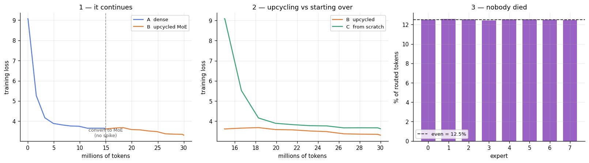

# Dense → Mixture of Experts

**ERA V5, Session 14.** Train a linear (dense) model, convert it into an MoE, and show that it continues to train and that the loss drops.

Everything is in [`dense_to_moe.ipynb`](dense_to_moe.ipynb), run end to end on a Colab **Tesla T4** (14.6 GB, float16).

---

## Experiment

| | Run | Params (total / active) | Tokens |
|---|---|---|---|
| **A** | Dense | 14.4M / 14.4M | 15M |
| **B** | A upcycled into an MoE, training continued | 64.7M / 27.0M | 15M more |
| **C** | The same MoE from random init — control | 64.7M / 27.0M | 15M |

Run C is the reason this is an experiment rather than a demonstration. "The loss dropped after converting" proves nothing by itself, because more training always drops the loss. The claim only holds if the upcycled model beats the *same architecture* trained from scratch on the *same tokens with the same schedule*.

**Model.** 8 layers, `d_model` 384, 6 heads, `ff` 1024, context 512. MoE: 8 routed experts, top-2, one shared expert always on, sigmoid router, γ = 0.001.

**Data.** AI4Bharat Sangraha (`verified`), six languages — Hindi 30%, Telugu 25%, Tamil 15%, Marathi 10%, Bengali 10%, English 10%. 35M tokens pooled, 1M held out, documents shuffled whole so the languages interleave. Tokenizer: my own 8192-piece byte-level BPE trained on the same mix.

| | hin | tel | tam | mar | ben | eng |
|---|---|---|---|---|---|---|
| tokens | 13.87M | 12.60M | 7.43M | 4.84M | 4.82M | 5.34M |
| bytes/token | 3.88 | 3.56 | 3.63 | 3.71 | 3.73 | 3.36 |

---

## Results

| run | total | active | val loss | ppl | tok/s | peak MB | min |
|---|---:|---:|---:|---:|---:|---:|---:|
| A dense | 14.4M | 14.4M | 3.7051 | 40.7 | 91,908 | 3,516 | 2.7 |
| **B upcycled MoE** | 64.7M | 27.0M | **3.4114** | **30.3** | 44,792 | 6,557 | 5.6 |
| C MoE from scratch | 64.7M | 27.0M | 3.7272 | 41.6 | 45,049 | 7,089 | 5.5 |



---

## 1. Does it continue to train?

Yes, and it is guaranteed rather than observed.

Every expert is initialised as a copy of the dense model's FFN. Since the gates are normalised to sum to 1:

```
Σ gateᵢ · F(x) = F(x) · Σ gateᵢ = F(x) · 1 = F(x)
```

The converted MoE *is* the dense model, as a function. Verified in float64 before any GPU time:

```
 4 experts, top-1, shared=False   logit error 0.0e+00   loss 6.249866 -> 6.249866   random router 6.249866   PASS
 8 experts, top-2, shared=False   logit error 7.7e-16   loss 6.249866 -> 6.249866   random router 6.249866   PASS
 8 experts, top-2, shared=True    logit error 7.2e-16   loss 6.249866 -> 6.249866   random router 6.249866   PASS
16 experts, top-4, shared=True    logit error 7.2e-16   loss 6.249866 -> 6.249866   random router 6.249866   PASS
```

The third column is the stronger check: scrambling the router leaves the loss unchanged. Since every expert is an identical copy, *which* two are selected cannot matter — and if the gates were not summing to 1, this is where it would show.

On real tokens in float16 the two models' losses differ by **7.15e-06**, which is 16-bit rounding rather than a change in behaviour.

Plot 1 shows the consequence: one unbroken curve across the conversion at 15M tokens, no spike and no restart.

## 2. Does the loss drop?

**3.7051 → 3.4114**, a fall of 0.294 (7.9%). Perplexity **40.7 → 30.3**.

Taken alone this is not evidence of anything, which is what run C is for.

## 3. Was upcycling worth it?

| | val loss |
|---|---:|
| B — upcycled | **3.4114** |
| C — from scratch | 3.7272 |
| gap | **0.3158** |

Same architecture, same 15M tokens, same learning rate and schedule. The only difference is where the weights started.

The sharper observation is that **run C never even caught the dense model it was meant to replace** — 3.7272 against the dense model's 3.7051, despite holding 4.5× the parameters. A 64.7M-parameter MoE given 15M tokens from scratch is worse than a 14.4M-parameter dense model given the same 15M tokens. Capacity is not free; it has to be paid for in tokens. Upcycling is how you avoid paying twice.

## 4. Did any expert die?

No, and the balance is close to exact:

```
busiest 12.6%   quietest 12.4%   perfectly even would be 12.5%
dead experts (under 1% of even): 0 of 8
```

A spread of 0.2 percentage points across 8 experts, achieved with **no auxiliary loss** — only the ±γ bias nudge applied after each step. Plot 3 shows eight bars sitting on the 12.5% line.

That bias never touches the loss and never scales an output; it only reorders the top-k selection. The loss stayed pure next-token prediction throughout.

## 5. What the MoE bought, and what it cost

**Bought:** 64.7M parameters held, 27.0M used per token — **2.4× more knowledge than compute** — and 0.294 lower loss than the dense model it came from.

**Cost:** throughput fell from 91,908 to 44,792 tokens/s, i.e. **2.05× slower**, and peak memory rose from 3,516 MB to 6,557 MB.

The slowdown is expected and is not a defect of the implementation. Top-2 plus a shared expert means three FFNs run per token instead of one, and each expert is dispatched as its own small matmul, so the GPU spends much of its time on kernel launches rather than arithmetic. A single-GPU MoE of this size is a correctness and dynamics experiment, not a speed win — MoEs pay off when the experts are spread across devices and each one receives a batch large enough to saturate its matmul.

---

## Reproducing

```
Part 5  conversion proof      seconds
Part 6  download + tokenise   ~10 min
Part 8  three runs            13.8 min   (2.7 + 5.6 + 5.5)
```

Fixed for comparability: model size, batch 32, seed 1337, and the same learning-rate schedule for both MoE runs.

**One T4-specific trap worth recording.** `torch.cuda.is_bf16_supported()` returns `True` on a T4, but Turing has no bfloat16 tensor cores — bf16 there is emulated and runs about 10× slower. The 16-bit type is selected by compute capability instead: bfloat16 only on Ampere or newer, float16 on Turing.
